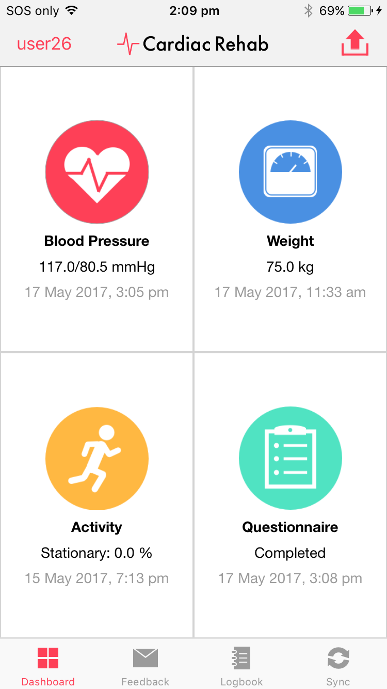

# Cardiac Rehabilitation
This iOS application aims to contribute to the field of cardiac telehealth, designed to be incorporated in smartphone-based cardiac rehabilitation programs. The key features includes:
* Health data storage, tracking and visualisations
* Extendible, automatic wireless synchronisation of measurement data with Bluetooth LE measurement devices such as the Aoeom U80LH blood pressure monitor
* Integration with an existing telehealth architecture (KIOLA)
* Clinical feedback system

*Note: source code is not provided due to confidentiality of APIs used* 

## Background
Cardiac rehabilitation refers to “all measures used to help people with heart disease return to an active and satisfying life and to prevent recurrence of cardiac events” (National Heart Foundation of Australia and Australian Cardiac Rehabilitation Association). These procedures are designed to assist the recovery of patients who have undertaken revascularisation procedures such as vascular bypass surgery, as well as those who are suffering from cardiovascular diseases such as coronary artery disease, stroke and heart failure.

Cardiovascular diseases are one of the major health problems worldwide:
* An estimated 17.7 million people died from a cardiovascular disease in 2015, amounting to 31% of global mortalities
* 1 Australian dies from cardiovascular disease every 12 minutes, making it the number one cause of death in Australia
* 1 in 6 Australians suffer from some form of cardiovascular disease, which equates to a staggering total of approximately 3.72 million people

The importance of cardiac rehabilitation is highlighted by the fact that 1 in 3 heart attack sufferersare repeat patients. Repeated cardiac events increase hospitalisation and readmission rates, and cost the Australian health industry about $8.4 billion per year. Cardiac rehabilitation programs are thus required in order alleviate this issue. Such programs aim to assist patients in minimising the likelihood of repeat cardiac events occurring, traditionally through a combination of measures including managing lifestyle risk factors such as physical inactivity, diet and tobacco use, and organising clinical visits to receive medical advice and feedback. While such centre-based cardiac rehabilitation programs have exhibited effectiveness, as modern technologies advance, the incorporation of smartphone technology into cardiac rehabilitation solutions is becoming an increasingly impactful area of research. 

## Screenshots
### Dashboard

### UI Flows
#### Recording health data

#### Viewing health data

#### Tracking health data history

#### Viewing clinical feedback

#### Integration with KIOLA telehealth architecture

#### Synchronisation of measurement data with third-party measurement devices using Bluetooth LE

